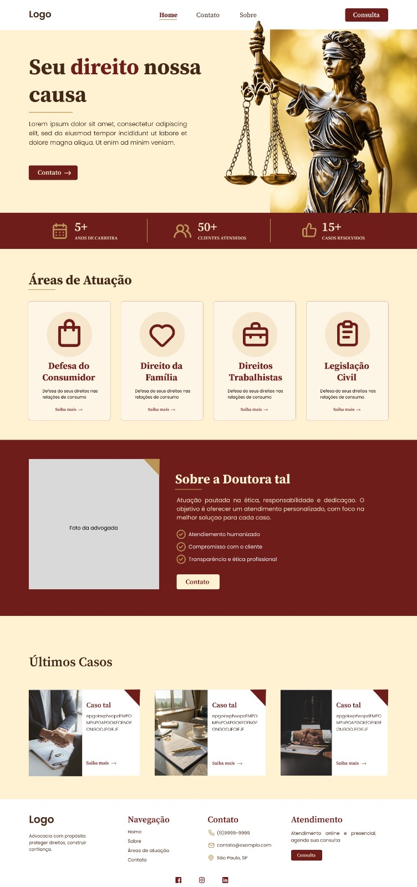

# ⚖️ Portfólio Jurídico

Site institucional e portfólio profissional desenvolvido para uma advogada em início de carreira, com o objetivo de divulgar seus serviços, construir presença digital e oferecer conteúdos informativos sobre direitos.

---

## 🚀 Objetivos
- **Divulgação Profissional:** Apresentar a trajetória e as áreas de atuação da advogada.
- **Atendimento Fácil:** Facilitar o contato de clientes via WhatsApp e canais diretos de agendamento.

---

## 🏛️ Caráter Extensionista 
O projeto utiliza a tecnologia para apoiar o início de carreira da profissional e aproximar os serviços jurídicos da comunidade. O site facilita o acesso direto à advogada e traduz conceitos legais para uma linguagem acessível e clara.

---

## 💡 Processo de Ideação 
Partindo da iniciativa de criar um site para apoiar uma advogada em início de carreira, o objetivo central foi alinhar um design moderno e confiável (utilizando uma paleta sóbria em tons de bordô e bege) a uma experiência de navegação intuitiva e fluida.

---

## 🎨 Protótipos

### Protótipo Inicial (Esboço e Planejamento)
<p>
  
  
</p>

### Protótipo de Alta
<p>
  
</p>

---

## Tutorial e Estrutura Home

A página principal (`index.html`) foi estruturada utilizando **HTML5 Semântico**, garantindo acessibilidade, facilidade de manutenção e boa indexação (SEO).

### Tags HTML Utilizadas
* `<header>` e `<nav>`: Organização do menu superior e links de navegação principal.
* `<main>`: Agrupamento de todo o conteúdo central e exclusivo da página.
* `<section>`: Divisão das seções temáticas da página (Hero, Estatísticas, Áreas de Atuação, Sobre, Últimos Casos).
* `<article>`: Utilizado para blocos autônomos e reutilizáveis, como o bloco principal, cards de áreas de atuação e de casos.
* `<figure>` e ``: Exibição semântica de imagens acompanhadas do atributo `alt` para acessibilidade.
* `<ul>` e `<li>`: Organização de listas de links de navegação, indicadores de estatísticas e diferenciais.
* `<address>`: Elemento semântico para exibição dos dados de contato diretos no rodapé.
* `<footer>`: Rodapé da página contendo mapa do site, informações institucionais e redes sociais.

---

### Trechos Resumidos do Código

#### 1. Cabeçalho e Menu de Navegação (`<header>` e `<nav>`)
```html
<header>
  <nav class="menu">
    <a href="#" class="logo">Logo</a>

    <ul class="nav_links">
      <li><a href="#">Home</a></li>
      <li><a href="#">Contato</a></li>
      <li><a href="#">Sobre</a></li>
    </ul>

    <a href="#" class="botao_consulta">Consulta</a>
  </nav>
</header>
```

#### 2. Seção Principal / Hero (`<main>`, `<section>`, `<article>`)
```html
<main>
  <section class="principal">
    <article class="container_principal">
      <div class="principal_texto">
        <h1 class="titulo_principal">Seu <span>direito</span> nossa causa</h1>
        <p class="descricao">Lorem ipsum dolor sit amet, consectetur adipiscing elit...</p>
        <a href="#" class="botao_contato">Contato</a>
      </div>
      <figure class="imagem_estatua">
        
      </figure>
    </article>
  </section>
</main>
```

#### 3. Cards de Áreas de Atuação (`<article>`)
```html
<section class="areas-atuacao">
  <article class="cartao">
    
    <h2 class="titulo-cartao">Defesa do Consumidor</h2>
    <p class="descricao-cartao">Defesa dos seus direitos nas relações de consumo.</p>
    <a href="#" class="link-cartao">Saiba mais &rarr;</a>
  </article>
</section>
```

#### 4. Rodapé e Endereço (`<footer>` e `<address>`)
```html
<footer>
  <section class="container_footer">
    <!-- Navegação e Institucional -->
    <address class="footer_info">
      <h2>Contato</h2>
      <p>(11) 9999-9999</p>
      <p>contato@exemplo.com</p>
      <p>São Paulo, SP</p>
    </address>
  </section>
</footer>
```
## Tutorial e Estrutura Sobre

A página Sobre (`sobre.html`) foi estruturada utilizando **HTML5 Semântico**, garantindo uma organização clara do conteúdo, acessibilidade, facilidade de manutenção e boa indexação (SEO).

### Tags HTML Utilizadas

- `<header>` e `<nav>`: Organização do cabeçalho e do menu principal de navegação.
- `<main>`: Agrupamento de todo o conteúdo principal e exclusivo da página.
- `<section>`: Divisão das áreas temáticas da página, como apresentação da advogada, estatísticas e áreas de atuação.
- `<article>`: Utilizado para conteúdos independentes, como informações sobre a advogada, estatísticas e cards das áreas de atuação.
- `<figure>` e ``: Exibição semântica da imagem da advogada e dos ícones das áreas de atuação, utilizando o atributo `alt` para acessibilidade.
- `<h1>` e `<h2>`: Organização hierárquica dos títulos e subtítulos da página.
- `<p>`: Apresentação dos textos descritivos e informações institucionais.
- `<strong>`: Destaque dos valores das estatísticas, como quantidade de casos resolvidos e anos de carreira.
- `<span>`: Complementação das informações apresentadas nas estatísticas.
- `<ul>` e `<li>`: Organização das listas de links de navegação do cabeçalho e rodapé.
- `<address>`: Exibição semântica dos dados de contato, como telefone, e-mail e localização.
- `<footer>`: Rodapé da página contendo informações institucionais, navegação, contato, atendimento e redes sociais.

---

### Trechos Resumidos do Código

#### 1. Cabeçalho e Menu de Navegação (`<header>` e `<nav>`)

O cabeçalho contém o logotipo, os links principais de navegação e o botão para consulta.

```html
<header>
    <nav class="menu">
        <a href="#" class="logo">Logo</a>

        <ul class="nav_links">
            <li><a href="inicio.html">Home</a></li>
            <li><a href="#">Contato</a></li>
            <li><a href="sobre.html">Sobre</a></li>
        </ul>

        <a href="#" class="botao_consulta">Consulta</a>
    </nav>
</header>


<main>
    <section class="sobre">
        <article class="sobre_texto">
            <h1 class="sobre_titulo">Sobre a Dr. Tal</h1>

            <p class="sobre_descricao">
                Atuação jurídica pautada pela ética, dedicação e
                compromisso com cada cliente. Advogada Tal oferece
                orientação personalizada e soluções estratégicas para
                proteger seus direitos e interesses.
            </p>

            <a href="#" class="botao_contato">Contato</a>
        </article>
    </section>
</main>

<section class="estatisticas">

    <article class="estatistica">
        <strong>+100</strong>
        <span>Casos resolvidos</span>
    </article>

    <article class="estatistica">
        <strong>5</strong>
        <span>Anos de carreira</span>
    </article>

</section>


---

## ✨ Integrantes
- Gabrielly Nogueira Rodrigues (10762966)
- Hellen Novi Salvador (10771422)
- Isabela Lopes Morresi (10771436)
- Julia Peres Cardoso (10771419)
- Natália Vaz Cerqueira (10779837)
