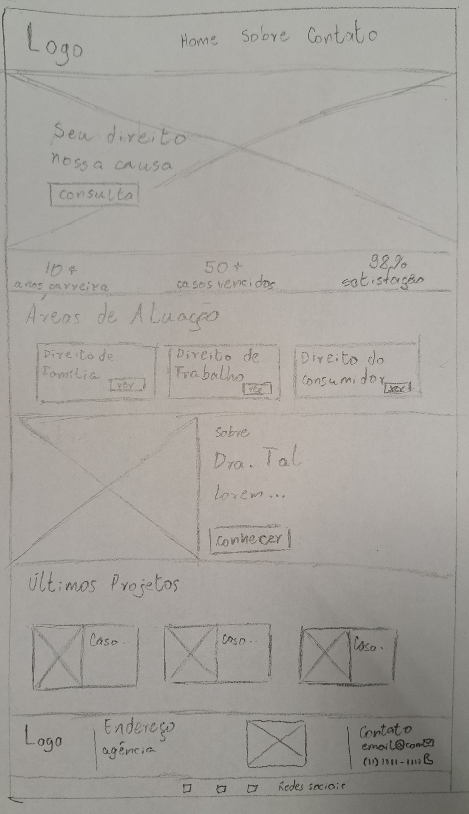
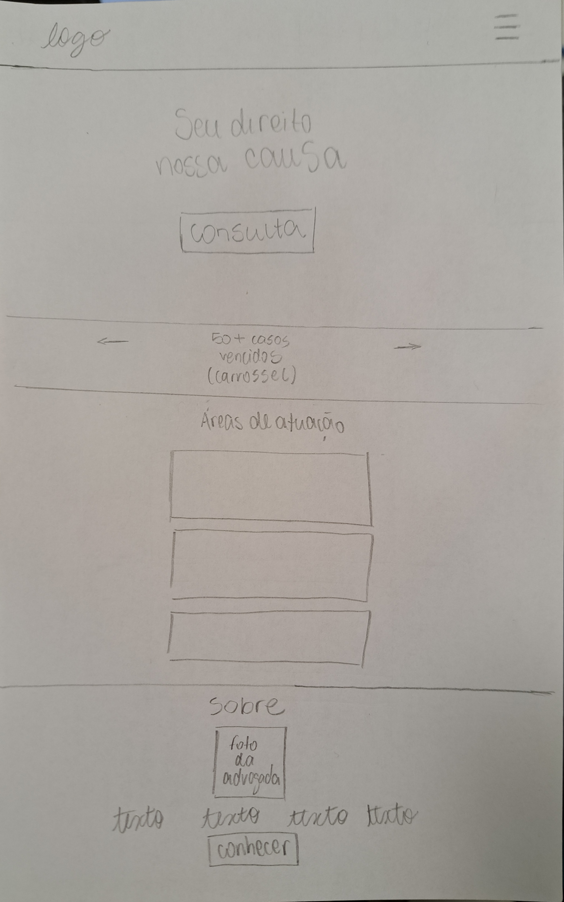

# ⚖️ Portifólio Jurídico

Site institucional e portfólio profissional desenvolvido para uma advogada em início de carreira, com o objetivo de divulgar seus serviços, construir presença digital e oferecer conteúdos informativos sobre direitos.

## 🚀 Objetivos
- **Divulgação Profissional:** Apresentar a trajetória e as áreas de atuação da advogada.
- **Atendimento Fácil:** Facilitar o contato de clientes via WhatsApp e formulário.

## Caráter Extensionista 
É usar a tecnologia para apoiar o início de carreira da advogada e ajudar pequenos empreendedores. O site facilita o acesso direto à profissional e explica os direitos de quem está começando um negócio com palavras simples, sem complicação.

## Processo de Ideação 
Ideação do Portfólio Web

Partindo da ideia de criar um site para a prima da Natália — uma advogada em início de carreira —, o objetivo central é alinhar um visual moderno e confiável a uma navegação simples.

Estrutura da Página

- Início: Nome, foto profissional e área de atuação principal.
- Sobre Mim: Formação, valores e trajetória acadêmica.
- Áreas de Atuação: Resumo dos serviços prestados (ex.: Direito Civil, Trabalhista).
- Contato: Formulário simples, links de redes sociais e botão para o WhatsApp.

Aplicações de JavaScript

Menu Responsivo: Menu hambúrguer dinâmico para navegação no celular.
Rolagem Suave: Transição suave entre as seções ao clicar nos links do menu.
Validação do Formulário: Checagem dinâmica de e-mail e telefone antes do envio da mensagem.

## Protótipo 

  
  

## ✨ Integrantes
- Gabrielly Nogueira Rodrigues (10762966)
- Hellen Novi Salvador (10771422)
- Isabela Lopes Morresi (10771436)
- Julia Peres Cardoso (10771419)
- Natália Vaz Cerqueira (10779837)

