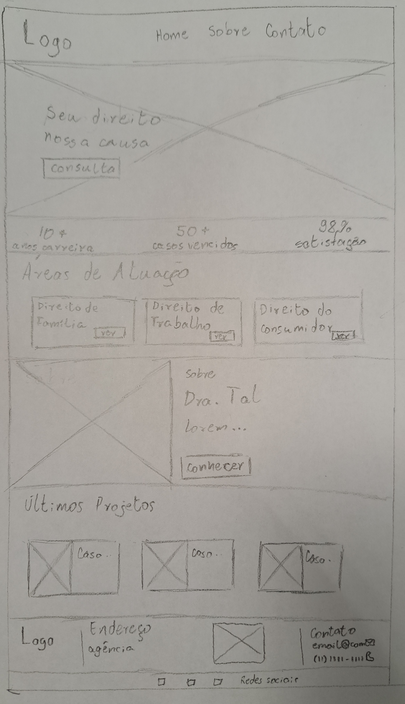
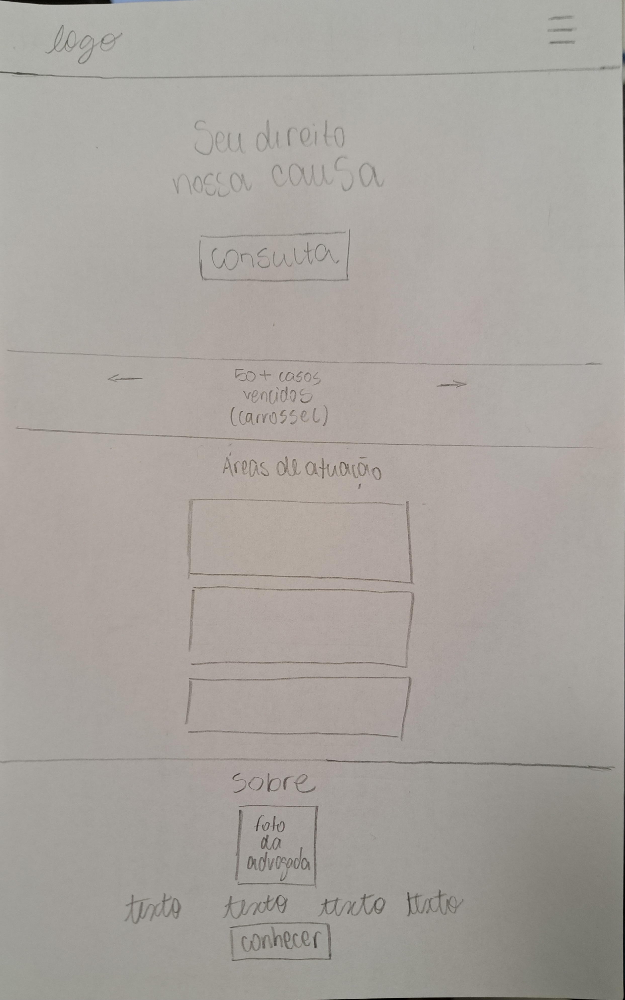
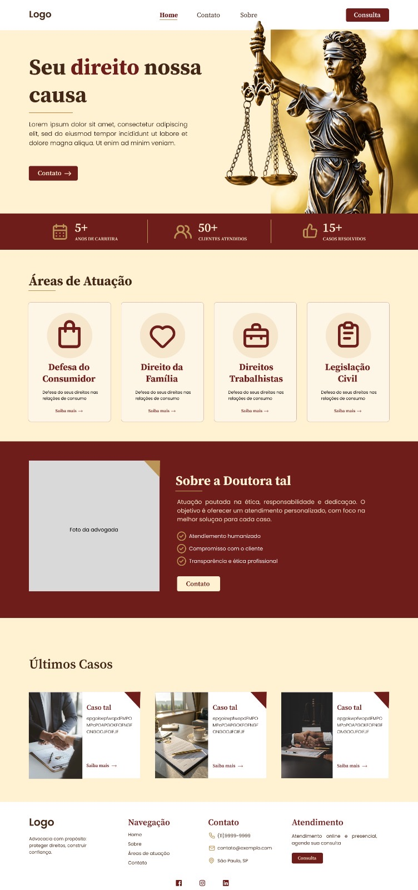

# ⚖️ Portfólio Jurídico

Site institucional e portfólio profissional desenvolvido para uma advogada em início de carreira, com o objetivo de divulgar seus serviços, construir presença digital e oferecer conteúdos informativos sobre direitos.

---

## 🚀 Objetivos
- **Divulgação Profissional:** Apresentar a trajetória e as áreas de atuação da advogada.
- **Atendimento Fácil:** Facilitar o contato de clientes via WhatsApp e canais diretos de agendamento.

---

## 🏛️ Caráter Extensionista
O projeto utiliza a tecnologia como instrumento de apoio ao início da carreira profissional da advogada e, ao mesmo tempo, como meio de aproximar os serviços jurídicos da comunidade. A proposta parte da compreensão de que o acesso à Justiça também envolve o acesso à informação e ao conhecimento sobre direitos, buscando reduzir as barreiras impostas pela complexidade da linguagem jurídica.

Por meio do site, conceitos e informações jurídicas são apresentados de forma clara e acessível, criando um canal de comunicação mais próximo entre a profissional e a sociedade. Dessa forma, a plataforma não se limita à divulgação dos serviços, mas contribui para a democratização do conhecimento jurídico e para o fortalecimento da autonomia dos cidadãos na compreensão de seus direitos e na busca por orientação adequada.

Nesse sentido, o caráter extensionista do projeto está na integração entre tecnologia, conhecimento jurídico e demandas da comunidade, utilizando os recursos digitais como ferramentas de comunicação, inclusão e transformação social. 

---

## 💡 Processo de Ideação
Partindo da iniciativa de criar um site para apoiar uma advogada em início de carreira, o objetivo central foi alinhar um design moderno e confiável (utilizando uma paleta sóbria em tons de bordô e bege) a uma experiência de navegação intuitiva e fluida.

---

## 🎨 Protótipos

### Protótipo Inicial (Esboço e Planejamento)
<p>
  
  
</p>

### Protótipo de Alta
<p>
  
</p>

---

## Tutorial e Estrutura Home

A página principal (`inicio.html`) foi estruturada utilizando **HTML5 Semântico**, garantindo acessibilidade, facilidade de manutenção e boa indexação (SEO).

### Tags HTML Utilizadas
* `<header>` e `<nav>`: Organização do menu superior e links de navegação principal.
* `<main>`: Agrupamento de todo o conteúdo central e exclusivo da página.
* `<section>`: Divisão das seções temáticas da página (Hero, Estatísticas, Áreas de Atuação, Sobre, Últimos Casos).
* `<article>`: Utilizado para blocos autônomos e reutilizáveis, como o bloco principal, cards de áreas de atuação e de casos.
* `<figure>` e ``: Exibição semântica de imagens acompanhadas do atributo `alt` para acessibilidade (usado na foto da advogada).
* `<ul>` e `<li>`: Organização de listas de links de navegação, indicadores de estatísticas e diferenciais.
* `<address>`: Elemento semântico para exibição dos dados de contato diretos no rodapé.
* `<footer>`: Rodapé da página contendo mapa do site, informações institucionais e redes sociais.

---

### Trechos Resumidos do Código

#### 1. Cabeçalho e Menu de Navegação (`<header>` e `<nav>`)
```html
<header>
  <nav class="menu">
    <a href="inicio.html" class="logo">
      
    </a>

    <ul class="nav_links">
      <li><a href="inicio.html">Home</a></li>
      <li><a href="sobre.html">Sobre</a></li>
      <li><a href="contato.html">Contato</a></li>
    </ul>

    <a href="#" class="botao_consulta">Consulta</a>
    <button class="menu_hamburguer" id="menu-hamburguer">☰</button>
  </nav>
</header>
```

#### 2. Seção Principal / Hero (`<main>`, `<section>`, `<article>`)
A imagem de fundo e a estátua da justiça são duas imagens sobrepostas dentro do mesmo container, posicionadas com `position: relative/absolute`.
```html
<main>
  <section class="principal">
    <article class="container_principal">
      <div class="principal_texto">
        <h1 class="titulo_principal">Seu <span>direito</span> nossa causa</h1>
        <p class="descricao">Atuo na análise preventiva, elaboração de contratos...</p>
        <a href="contato.html" class="botao_contato botao_contato_principal">Contato</a>
      </div>
      <div class="container_hero_imagens">
        
        
      </div>
    </article>
  </section>
</main>
```

#### 3. Barra de Estatísticas (`<ul>` e `<li>`)
```html
<section class="barra_estatisticas">
  <ul class="grade_estatisticas">
    <li class="item_estatistica">
      
      <p>
        <strong class="numero_estatistica">5+</strong>
        <span class="rotulo_estatistica">Anos de Carreira</span>
      </p>
    </li>
    <li class="separador"></li>
    <!-- Demais itens de estatística omitidos para brevidade -->
  </ul>
</section>
```

#### 4. Cards de Áreas de Atuação (`<article>`)
```html
<section class="areas_atuacao">
  <div class="container_cards">
    <article class="cartao">
      
      <h2 class="titulo_cartao">Defesa do Consumidor</h2>
      <p class="descricao_cartao">Defesa dos seus direitos nas relações de consumo.</p>
      <a href="#" class="link_cartao">Saiba mais</a>
    </article>
  </div>
</section>
```

#### 5. Carrossel de Últimos Casos (`<section>`, `<div>`)
Os cards são organizados em "grupos" de 3, e o JavaScript movimenta o container `#grupo-casos` horizontalmente para simular o slide.
```html
<section class="noticias">
  <div class="carrossel-area">
    <div class="carrossel-container">
      <div class="carrossel-grupo" id="grupo-casos">
        <div class="grupo-cards">
          <article class="caso_card card">
            
            <div class="caso_conteudo">
              <h3 class="caso_titulo">Quebra de Contrato</h3>
              <p class="caso_texto">Empresa com quebra de contrato sem aviso prévio...</p>
              <a href="#" class="card_link">Saiba mais</a>
            </div>
          </article>
          <!-- Mais 2 cards no mesmo grupo -->
        </div>
        <!-- Outro(s) .grupo-cards com os próximos 3 casos -->
      </div>
    </div>
    <div class="controles">
      <button id="anterior-casos" class="botao-redondo">&lt;</button>
      <button id="proximo-casos" class="botao-redondo">&gt;</button>
    </div>
  </div>
</section>
```

#### 6. Rodapé e Endereço (`<footer>` e `<address>`)
```html
<footer>
  <section class="container_footer">
    <address class="footer_info footer_contato">
      <h2>Contato</h2>
      <div class="contato_item"><p>(11) 9999-9999</p></div>
      <div class="contato_item"><p>contato@exemplo.com</p></div>
      <div class="contato_item"><p>São Paulo, SP</p></div>
    </address>
  </section>
</footer>
```

---

## Tutorial e Estrutura CSS (Home)

A estilização da página Home (`inicio.css`) mantém a identidade visual do projeto e organiza os principais blocos da página com **Flexbox**, **CSS Grid**, posicionamento relativo/absoluto e efeitos simples de interação.

### Principais Técnicas CSS Utilizadas

* **Reset global e `box-sizing`**: remove margens e espaçamentos padrões do navegador e facilita o controle das dimensões.
* **Flexbox (`display: flex`)**: utilizado no menu, Hero, cards, seção Sobre e cards de casos.
* **CSS Grid (`display: grid`)**: utilizado na barra de estatísticas, no rodapé e na estrutura interna do carrossel.
* **Posicionamento (`relative` e `absolute`)**: permite sobrepor a estátua à imagem do Hero e criar detalhes decorativos.
* **`z-index`**: define qual elemento deve aparecer à frente nas sobreposições.
* **`object-fit`**: mantém imagens proporcionais dentro de espaços com tamanhos definidos.
* **Pseudo-elementos (`::after`)**: utilizados para a seta do botão e detalhes decorativos.
* **`overflow: hidden` + `transform`**: base do funcionamento do carrossel de casos.
* **`hover`, `transform` e `transition`**: criam respostas visuais em links e cards.
* **Media queries (`@media`)**: adaptam o layout para dispositivos móveis.

### Trechos Resumidos do Código CSS

#### 1. Configuração Global e Tipografia

```css
* {
    margin: 0;
    padding: 0;
    box-sizing: border-box;
}

body {
    background-color: #FFF2D2;
    color: #4a241b;
    font-family: 'Source Serif Pro', serif;
}
```

O `box-sizing: border-box` faz com que `padding` e `border` sejam considerados dentro da largura e altura definidas para cada elemento, evitando cálculos extras no layout.

#### 2. Menu com Flexbox

```css
.menu {
    height: 68px;
    display: flex;
    align-items: center;
    justify-content: space-between;
    padding: 0 95px;
    background-color: #ffffff;
}

.nav_links {
    display: flex;
    gap: 45px;
    list-style: none;
}
```

O Flexbox posiciona logo, navegação e botão na mesma linha. `justify-content: space-between` distribui os grupos horizontalmente e `align-items: center` centraliza todos verticalmente.

#### 3. Hero e Sobreposição das Imagens

```css
.container_principal {
    height: 423px;
    display: flex;
    position: relative;
}

.principal_texto {
    width: 55%;
}

.container_hero_imagens {
    width: 45%;
    position: relative;
}

.img_estatua_sobreposta {
    position: absolute;
    top: -10px;
    left: 10%;
    height: 434px;
    width: auto;
    object-fit: contain;
    z-index: 2000;
    pointer-events: none;
}
```

O Hero é dividido entre texto e imagem. O container da imagem recebe `position: relative`, tornando-se referência para a estátua com `position: absolute`. O `z-index` alto garante que a estátua fique acima da imagem de fundo, e `pointer-events: none` evita que a imagem sobreposta capture cliques do mouse.

#### 4. Barra de Estatísticas com Grid

```css
.grade_estatisticas {
    height: 100px;
    display: grid;
    grid-template-columns: 1fr auto 1fr auto 1fr;
    align-items: center;
}
```

A grade alterna três áreas de conteúdo com dois separadores (`.separador`). As colunas `1fr` dividem igualmente o espaço disponível e as colunas `auto` ocupam apenas a largura necessária.

#### 5. Cards e Efeito de Hover

```css
.container_cards {
    display: flex;
    justify-content: center;
    gap: 25px;
}

.cartao {
    display: flex;
    flex-direction: column;
    align-items: center;
    transition: 0.2s;
}

.cartao:hover {
    transform: translateY(-5px);
    box-shadow: 0 8px 20px rgba(74, 36, 27, 0.12);
}
```

Os cards ficam alinhados horizontalmente, enquanto seus conteúdos são organizados em coluna. No `hover`, o deslocamento e a sombra criam um efeito de elevação.

#### 6. Seção Sobre e Detalhe Decorativo

```css
.sobre {
    background-color: #6F1D1B;
    padding: 60px 120px;
    display: flex;
    align-items: center;
    justify-content: center;
    gap: 150px;
}

.img_advogada::after {
    content: "";
    position: absolute;
    top: 0;
    right: 0;
    border-top: 40px solid #BB9457;
    border-left: 40px solid transparent;
}
```

O Flexbox posiciona imagem e texto lado a lado. O `::after` cria um triângulo dourado apenas com bordas CSS, sem utilizar uma nova imagem.

#### 7. Carrossel de Casos

```css
.carrossel-container {
    width: 100%;
    overflow: hidden;
}

.carrossel-grupo {
    display: flex;
    transition: transform 0.4s ease-in-out;
    width: 100%;
}

.grupo-cards {
    display: flex;
    gap: 25px;
    min-width: 100%;
}
```

O `overflow: hidden` no container esconde tudo que estiver fora da área visível. Cada `.grupo-cards` ocupa `100%` da largura (um "slide"), e o JavaScript movimenta o `.carrossel-grupo` com `transform: translateX()` para exibir o próximo grupo.

#### 8. Rodapé com Grid

```css
.container_footer {
    display: grid;
    grid-template-columns: 1.5fr 1fr 1.3fr 1.3fr;
    gap: 50px;
}
```

O rodapé é dividido em quatro colunas proporcionais para logo, navegação, contato e atendimento.

#### 9. Responsividade (`@media`)

```css
@media (max-width: 768px) {
    .nav_links { display: none; }

    .nav_links.ativo {
        display: flex;
        position: absolute;
        top: 65px;
        flex-direction: column;
    }

    .menu_hamburguer { display: block; }

    .container_principal { flex-direction: column; }

    .container_cards { flex-direction: column; }

    .caso_card { min-width: 100%; flex-direction: column; }
}
```

Abaixo de 768px de largura, o menu horizontal é escondido e substituído pelo botão hambúrguer (controlado via JavaScript). Seções que usavam `flex-row` (Hero, cards, "Sobre") passam a empilhar em coluna, e o carrossel passa a mostrar um card por vez, ao invés de grupos de três.

---

## Tutorial e Estrutura JavaScript (Home e Sobre)

O JavaScript é compartilhado entre as páginas (`script.js`) e possui **três** funcionalidades principais: a animação dos números da seção de estatísticas, o carrossel de casos (com comportamento diferente para mobile e desktop) e o menu hambúrguer responsivo — cumprindo o requisito mínimo de 2 interações dinâmicas do lado cliente.

### Principais Técnicas JavaScript Utilizadas

* **`DOMContentLoaded`**: garante que o código seja executado somente depois que o conteúdo HTML da página estiver carregado.
* **`querySelectorAll`**: utilizado para selecionar elementos que possuem determinadas classes, como os números das estatísticas e os cards dos casos.
* **`getElementById`**: utilizado para localizar elementos específicos pelo seu `id`, como os botões, o grupo de casos e o botão hambúrguer.
* **`forEach`**: utilizado para percorrer os números das estatísticas e aplicar a animação individualmente.
* **`setInterval` e `clearInterval`**: utilizados para criar e finalizar a contagem animada dos números.
* **`addEventListener`**: utilizado para identificar ações do usuário, como cliques nos botões do carrossel, no botão hambúrguer, e alterações no tamanho da janela.
* **`window.innerWidth`**: utilizado para identificar a largura da tela e adaptar o funcionamento do carrossel para mobile ou desktop.
* **`offsetWidth`**: utilizado para obter a largura dos cards e calcular o deslocamento do carrossel no mobile.
* **`classList.toggle`**: utilizado para abrir e fechar o menu mobile.
* **`transform` e `translateX`**: utilizados para movimentar os cards horizontalmente no carrossel.

### Trechos do Código JavaScript

#### 1. Carregamento do Documento

```javascript
document.addEventListener("DOMContentLoaded", function () {
    // Código executado após o carregamento do HTML
});
```

O `DOMContentLoaded` faz com que o código JavaScript seja executado somente depois que o HTML da página estiver carregado. Isso evita que o JavaScript tente acessar elementos que ainda não foram criados pelo navegador.

#### 2. Animação das Estatísticas

```javascript
const numeros = document.querySelectorAll(".numero_estatistica");

numeros.forEach(function (numero) {
    const valorFinal = parseInt(numero.textContent) || 0;
    let contador = 0;

    if (valorFinal === 0) return;

    const intervalo = setInterval(function () {
        contador++;
        numero.textContent = contador + "+";

        if (contador >= valorFinal) {
            clearInterval(intervalo);
        }
    }, 100);
});
```

O `querySelectorAll` seleciona todos os elementos com a classe `.numero_estatistica` e o `forEach` percorre cada número individualmente. O valor final é obtido com `parseInt()` e o contador começa em zero. O `setInterval()` aumenta o número a cada 100 milissegundos, criando o efeito de contagem, e o `clearInterval()` encerra a animação ao atingir o valor final.

#### 3. Seleção dos Elementos do Carrossel

```javascript
const grupoCasos = document.getElementById("grupo-casos");
const btnAnteriorCaso = document.getElementById("anterior-casos");
const btnProximoCaso = document.getElementById("proximo-casos");
const gruposCasos = document.querySelectorAll("#grupo-casos .grupo-cards");
const cardsCasos = document.querySelectorAll("#grupo-casos .caso_card");

let indexCaso = 0;
```

O `getElementById()` localiza o grupo de casos e os botões de navegação, enquanto o `querySelectorAll()` seleciona todos os grupos (`.grupo-cards`) e todos os cards individuais (`.caso_card`) que fazem parte do carrossel. A variável `indexCaso` guarda a posição atual do carrossel.

#### 4. Controle da Posição do Carrossel

```javascript
function atualizarCarrosselCasos() {
    if (!grupoCasos || cardsCasos.length === 0) return;

    if (window.innerWidth <= 768) {
        const larguraCard = cardsCasos[0].offsetWidth;
        grupoCasos.style.transform = `translateX(-${indexCaso * larguraCard}px)`;
    } else {
        grupoCasos.style.transform = `translateX(-${indexCaso * 100}%)`;
    }
}
```

Quando a largura da tela é de até 768 pixels, o código considera o comportamento mobile e movimenta o carrossel card por card, usando `offsetWidth` para descobrir a largura real de um card. Em telas maiores, o carrossel se move em grupos de três, usando `translateX()` com porcentagem (`100%` = um grupo inteiro).

#### 5. Botões de Avançar e Voltar

```javascript
btnProximoCaso.addEventListener("click", function () {
    if (window.innerWidth <= 768) {
        if (indexCaso < cardsCasos.length - 1) indexCaso++;
    } else {
        if (indexCaso < gruposCasos.length - 1) indexCaso++;
    }
    atualizarCarrosselCasos();
});

btnAnteriorCaso.addEventListener("click", function () {
    if (indexCaso > 0) indexCaso--;
    atualizarCarrosselCasos();
});
```

No mobile, o código verifica a quantidade de cards individuais; no desktop, verifica a quantidade de grupos. Os `if` impedem que o `indexCaso` ultrapasse os limites (primeiro ou último item), evitando espaços em branco no carrossel.

#### 6. Adaptação ao Redimensionamento da Tela

```javascript
window.addEventListener("resize", function () {
    indexCaso = 0;
    atualizarCarrosselCasos();
});
```

Sempre que a janela é redimensionada, o `indexCaso` volta para zero e o carrossel é recalculado — evitando que a transição entre o modo mobile e desktop deixe o carrossel numa posição inválida.

#### 7. Menu Hambúrguer (Mobile)

```javascript
const menuHamburguer = document.getElementById("menu-hamburguer");
const navLinks = document.querySelector(".nav_links");

menuHamburguer.addEventListener("click", function () {
    navLinks.classList.toggle("ativo");

    if (navLinks.classList.contains("ativo")) {
        menuHamburguer.textContent = "✕";
    } else {
        menuHamburguer.textContent = "☰";
    }
});
```

Ao clicar no botão `☰`, a classe `.ativo` é alternada (`toggle`) na lista de links do menu, exibindo ou escondendo a navegação em telas pequenas (via CSS). O texto do próprio botão também muda entre `☰` e `✕`, indicando visualmente se o menu está aberto ou fechado.

---

## Tutorial e Estrutura Sobre

A página Sobre (`sobre.html`) foi estruturada utilizando **HTML5 Semântico**, garantindo uma organização clara do conteúdo, acessibilidade, facilidade de manutenção e boa indexação (SEO).

### Tags HTML Utilizadas

- `<header>` e `<nav>`: Organização do cabeçalho e do menu principal de navegação.
- `<main>`: Agrupamento de todo o conteúdo principal e exclusivo da página.
- `<section>`: Divisão das áreas temáticas da página, como apresentação da advogada, estatísticas e áreas de atuação.
- `<article>`: Utilizado para conteúdos independentes, como o bloco de texto sobre a advogada e os cards das áreas de atuação.
- `<figure>` e ``: Exibição semântica da imagem da advogada, com o atributo `alt` para acessibilidade.
- `<h1>` e `<h2>`: Organização hierárquica dos títulos e subtítulos da página.
- `<strong>`: Destaque dos valores das estatísticas (ex: "+100").
- `<span>`: Complementação das informações apresentadas nas estatísticas (ex: "Casos resolvidos").
- `<div class="linha">`: Usado tanto como divisor decorativo quanto como barra vertical entre as estatísticas.
- `<address>`: Exibição semântica dos dados de contato no rodapé.
- `<footer>`: Rodapé da página, seguindo o mesmo padrão das demais.

---

### Trechos do Código

#### 1. Cabeçalho e Menu de Navegação

```html
<header>
    <nav class="menu">
        <a href="inicio.html" class="logo"></a>
        <ul class="nav_links">
            <li><a href="inicio.html">Home</a></li>
            <li><a href="sobre.html">Sobre</a></li>
            <li><a href="contato.html">Contato</a></li>
        </ul>
        <a href="#" class="botao_consulta">Consulta</a>
    </nav>
</header>
```

#### 2. Apresentação da Advogada e Estatísticas

```html
<main>
    <section class="sobre">
        <article class="sobre_texto">
            <h1 class="sobre_titulo">Sobre a Dr. Luciana</h1>

            <p class="sobre_descricao">
                Atuação jurídica pautada pela ética, dedicação e
                compromisso com cada cliente.
            </p>

            <a href="contato.html" class="botao_contato">Contato</a>

            <section class="estatisticas">
                <div class="linha"></div>
                <article class="estatistica">
                    <strong class="numero_estatistica">+100</strong>
                    <span>Casos resolvidos</span>
                </article>
                <article class="estatistica">
                    <strong class="numero_estatistica">5</strong>
                    <span>Anos de carreira</span>
                </article>
                <div class="linha"></div>
            </section>
        </article>

        <figure class="img_advogada">
            
        </figure>
    </section>
</main>
```

Os dois `<div class="linha">` funcionam como barras verticais decorativas entre os blocos de estatística, alinhados via CSS Grid.

---

## Tutorial e Estrutura CSS (Sobre)

A página Sobre (`sobre.css`) reutiliza o padrão visual do menu, dos cards de áreas de atuação e do rodapé da Home, mas tem sua **própria** seção de apresentação: fundo claro (ao invés do fundo bordô usado na Home) e uma grade de estatísticas com divisores, que não existe em nenhuma outra página.

### Principais Técnicas CSS Utilizadas

* **Flexbox**: organiza a apresentação da advogada (texto + imagem lado a lado).
* **CSS Grid**: estrutura a grade de estatísticas com divisores verticais.
* **`object-fit: cover`**: mantém a fotografia proporcional dentro do espaço definido.
* **Pseudo-elemento `::after`**: adiciona o detalhe decorativo (triângulo dourado) na foto.
* **Reutilização de estilos**: menu, cards e rodapé seguem o mesmo padrão visual da Home.

### Trechos Resumidos do Código CSS

#### 1. Estrutura Principal da Seção Sobre

```css
.sobre {
    min-height: 570px;
    background-color: #FFF2D2;
    padding: 75px 8%;
    display: flex;
    align-items: center;
    justify-content: center;
    gap: 90px;
}

.sobre_texto { width: 520px; }

.sobre_titulo {
    color: #6F1D1B;
    font-size: 42px;
}

.sobre_descricao {
    color: #4a241b;
    font-size: 16px;
    line-height: 1.8;
    text-align: justify;
}
```

Ao contrário da seção "Sobre" da Home (fundo bordô, texto claro), aqui o fundo é claro (`#FFF2D2`) e o texto é escuro (`#6F1D1B` / `#4a241b`) — mantendo a paleta do projeto, mas invertendo o contraste para dar destaque próprio a essa página.

#### 2. Imagem da Advogada

```css
.img_advogada {
    width: 440px;
    height: 470px;
    border-radius: 4px;
    box-shadow: 0 8px 22px rgba(67, 40, 24, 0.16);
    position: relative;
    overflow: hidden;
}

.img_advogada::after {
    content: "";
    position: absolute;
    top: 0;
    right: 0;
    border-top: 45px solid #BB9457;
    border-left: 45px solid transparent;
}

.img_advogada img {
    width: 100%;
    height: 100%;
    object-fit: cover;
}
```

`object-fit: cover` faz a fotografia ocupar toda a área definida sem deformação. O `::after` repete o detalhe do triângulo dourado da Home, e `box-shadow` dá profundidade extra à foto.

#### 3. Grade de Estatísticas com Divisores

```css
.estatisticas {
    display: grid;
    grid-template-columns: auto 1fr 1fr auto;
    align-items: center;
    margin-top: 38px;
}

.estatisticas .linha {
    width: 2px;
    height: 65px;
    margin: 0;
    background-color: #BB9457;
}

.estatistica {
    display: flex;
    flex-direction: column;
    align-items: center;
    text-align: center;
}

.numero_estatistica {
    font-size: 34px;
    font-weight: 700;
}
```

As colunas `auto` correspondem às barras (`.linha`) e as colunas `1fr` correspondem aos dois blocos de estatística, criando o efeito "barra | número | número | barra".

#### 4. Áreas de Atuação (variação de fundo)

```css
.areas_atuacao {
    background-color: #F7E6C2;
    padding: 60px 8% 70px;
    border-top: 1px solid rgba(111, 29, 27, 0.12);
}
```

Nesta página o fundo da seção de cards é ligeiramente diferente (`#F7E6C2`) do usado na Home (`#FFF2D2`), criando uma leve separação visual entre as seções, complementada por uma borda superior sutil.

#### 5. Rodapé

```css
.container_footer {
    display: grid;
    grid-template-columns: 1.5fr 1fr 1.3fr 1.3fr;
    gap: 50px;
}
```

O mesmo Grid da Home é mantido para que as páginas tenham uma estrutura visual consistente.

#### 6. Responsividade

```css
@media (max-width: 768px) {
    .sobre { flex-direction: column; padding: 50px 20px; }
    .estatisticas {
        grid-template-columns: 1fr 1fr;
        gap: 20px;
    }
    .estatisticas .linha { display: none; }
    .container_cards { flex-direction: column; }
}
```

Em telas pequenas, a foto passa para baixo do texto, a grade de estatísticas vira 2 colunas (sem as barras divisórias, que ficam escondidas) e os cards de áreas de atuação empilham verticalmente.

---

## Tutorial e Estrutura Contato

A página de Contato (`contato.html`) foi estruturada utilizando **HTML5 Semântico**, focando na usabilidade e interatividade para facilitar o agendamento de consultas e o acesso rápido aos canais de atendimento da advogada, garantindo também acessibilidade e boa indexação (SEO).

### Tags HTML Utilizadas

* `<header>` e `<nav>`: Organização do cabeçalho e dos links de navegação principal.
* `<section>`: Divisão das grandes áreas da página, como o banner introdutório (Hero) e a sessão principal de contato.
* `<main>`: Agrupamento do conteúdo central, englobando as informações de atendimento e o formulário.
* `<h1>`, `<h2>` e `<h3>`: Organização hierárquica dos títulos, facilitando a leitura estrutural da página.
* ``: Exibição de imagens de fundo e ícones de contato/redes sociais, acompanhadas do atributo `alt` para acessibilidade.
* `<form>`, `<input>`, `<textarea>` e `<button>`: Elementos estruturais essenciais para a criação do formulário interativo de agendamento, permitindo a coleta de dados do usuário (nome, e-mail, telefone, data e mensagem).
* `<i>`: Utilizado em conjunto com a biblioteca FontAwesome para a inserção de ícones vetoriais nos campos do formulário.
* `<address>`: Elemento semântico para exibição oficial dos dados de contato (telefone, e-mail e localização).
* `<footer>`: Rodapé da página contendo logotipo, mapa do site, informações institucionais e links para redes sociais.

---

### Trechos Resumidos do Código

#### 1. Banner Introdutório / Hero (`<section>`)
O banner apresenta uma imagem de fundo imersiva e a chamada principal para a ação de contato.

```html
<section class="hero_contato">
    
    <div class="hero_conteudo">
        <h1>Entre em contato!</h1>
        <p>
            Entre em contato e agende uma conversa para entender seus direitos e
            encontrar o melhor caminho para o seu caso.
        </p>
    </div>
</section>
```

#### 2. Informações de Atendimento (`<main>` e `<div>`)
Bloco que agrupa os canais diretos de comunicação e os links para as redes sociais da advogada.

```html
<main>
    <section class="area-contato">
        <div class="container-contato">
            <div class="informacoes">
                <h2>Informações de contato</h2>
                <p class="descricao">Precisa de orientação? Estamos prontas para ouvir você.</p>

                <div class="informacao">
                    <a href="#"></a>
                    <div class="texto-informacao">
                        <h3>Telefone</h3>
                        <p>(11) 9999-9999</p>
                    </div>
                </div>

                <!-- Outras informações e redes sociais omitidas para brevidade -->
            </div>
```

#### 3. Formulário de Agendamento (`<form>`)
Estrutura semântica responsável por captar os dados do cliente para a marcação de consultas, utilizando ícones (FontAwesome) para melhor UX.

```html
            <div class="formulario">
                <h2>Agende uma consulta</h2>

                <form action="">
                    <div class="campo">
                        <i class="fa-regular fa-user"></i>
                        <input type="text" name="nome" placeholder="Nome" required>
                    </div>

                    <div class="campo">
                        <i class="fa-regular fa-envelope"></i>
                        <input type="email" name="email" placeholder="Email" required>
                    </div>

                    <!-- Campos de telefone e data omitidos para brevidade -->

                    <div class="campo mensagem">
                        <i class="fa-regular fa-comment"></i>
                        <textarea name="mensagem" placeholder="Mensagem"></textarea>
                    </div>

                    <div class="area-botao">
                        <button type="submit">Enviar</button>
                    </div>
                </form>
            </div>
        </div>
    </section>
</main>
```

#### 4. Rodapé da Página (`<footer>` e `<address>`)
O rodapé unifica a identidade visual e os contatos, mantendo o padrão das páginas anteriores.

```html
<footer>
    <section class="container_footer">
        <!-- Logo e Navegação -->

        <address class="footer_info footer_contato">
            <h2>Contato</h2>
            <div class="contato_item">
                
                <p>(11) 9999-9999</p>
            </div>
            <!-- E-mail e Endereço -->
        </address>

        <article class="footer_info footer_atendimento">
            <h2>Atendimento</h2>
            <p>Atendimento online e presencial, agende sua consulta.</p>
            <a href="#" class="btn_maroon">Consulta</a>
        </article>
    </section>
</footer>
```

## Tutorial e Estrutura CSS (Contato)

A estilização da página de Contato (`contato.css`) foi desenvolvida com foco em legibilidade e organização. O CSS utiliza **Flexbox**, **CSS Grid**, sobreposição de elementos e estilização personalizada do formulário.

### Principais Técnicas CSS Utilizadas

* **Flexbox**: utilizado no menu, itens de contato, redes sociais e campos do formulário.
* **CSS Grid**: divide o bloco principal entre informações de contato e formulário, além de estruturar o rodapé.
* **Posicionamento relativo e absoluto**: utilizado no Hero e na sobreposição entre seções.
* **Pseudo-elemento `::after`**: cria uma camada escura sobre a imagem do Hero para melhorar a leitura do texto.
* **Margem negativa**: faz o bloco de contato avançar sobre o Hero.
* **Inputs personalizados**: removem bordas padrões e integram ícones aos campos.
* **`hover` e `transition`**: oferecem retorno visual nos botões e redes sociais.

### Trechos Resumidos do Código CSS

#### 1. Hero e Camada de Sobreposição

```css
.hero_contato {
    width: 100%;
    height: 485px;
    position: relative;
    overflow: hidden;
    display: flex;
    align-items: center;
    justify-content: center;
    text-align: center;
}

.hero_contato img {
    position: absolute;
    width: 100%;
    height: 100%;
    object-fit: cover;
    z-index: 0;
}

.hero_contato::after {
    content: "";
    position: absolute;
    inset: 0;
    background-color: rgba(40, 23, 17, 0.48);
    z-index: 1;
}

.hero_conteudo {
    position: relative;
    z-index: 2;
    color: white;
}
```

A imagem ocupa todo o Hero. O `::after` cria uma camada semitransparente acima da imagem, enquanto `z-index: 2` mantém o texto visível à frente.

#### 2. Container Principal com Grid

```css
.container-contato {
    width: 78%;
    max-width: 1100px;
    margin: -110px auto 0;
    position: relative;
    z-index: 3;
    display: grid;
    grid-template-columns: 1fr 1.25fr;
    padding: 52px 50px;
}
```

O Grid divide o conteúdo em duas colunas: informações à esquerda e formulário à direita. A margem superior negativa faz o bloco subir sobre o Hero.

#### 3. Informações de Contato

```css
.informacoes {
    padding-right: 45px;
    border-right: 1px solid #8a6257;
}

.informacao {
    display: flex;
    align-items: center;
    gap: 15px;
    margin-bottom: 27px;
}
```

A borda separa visualmente as duas colunas. Cada informação utiliza Flexbox para manter ícone e texto alinhados.

#### 4. Redes Sociais

```css
.redes-icons {
    display: flex;
    gap: 20px;
}

.redes-icons a {
    display: flex;
    align-items: center;
    justify-content: center;
    border-radius: 50%;
    background-color: #6F1D1B;
    transition: 0.3s;
}

.redes-icons a:hover {
    background-color: #5a1715;
    transform: translateY(-2px);
}
```

Os ícones ficam alinhados horizontalmente e recebem um pequeno deslocamento ao passar o mouse.

#### 5. Campos do Formulário

```css
.campo {
    width: 100%;
    height: 43px;
    display: flex;
    align-items: center;
    gap: 13px;
    padding: 0 17px;
    margin-bottom: 23px;
    background-color: white;
    border-radius: 4px;
}

.campo input {
    width: 100%;
    height: 100%;
    border: none;
    outline: none;
    background: transparent;
}
```

O container `.campo` controla a aparência visual. O `input` fica transparente e sem borda, integrando-se ao mesmo bloco do ícone.

#### 6. Campo de Mensagem

```css
.campo.mensagem {
    height: 100px;
    align-items: flex-start;
    padding-top: 14px;
}

.campo textarea {
    width: 100%;
    height: 75px;
    border: none;
    outline: none;
    resize: none;
}
```

O `textarea` recebe uma altura maior por permitir mensagens mais longas. `resize: none` impede que o usuário altere manualmente seu tamanho.

#### 7. Botão de Envio

```css
.area-botao {
    display: flex;
    justify-content: flex-end;
}

.area-botao button {
    border: none;
    background-color: #6F1D1B;
    color: white;
    padding: 11px 22px;
    border-radius: 5px;
    font-weight: bold;
    cursor: pointer;
    transition: 0.3s;
}

.area-botao button:hover {
    background-color: #5a1715;
}
```

O Flexbox posiciona o botão à direita. `cursor: pointer` reforça que o elemento é clicável e a transição suaviza o efeito de `hover`.

#### 8. Rodapé

```css
.container_footer {
    display: grid;
    grid-template-columns: 1.5fr 1fr 1.3fr 1.3fr;
    gap: 50px;
}
```

O Grid organiza o rodapé nas mesmas quatro áreas das outras páginas, mantendo a identidade visual do projeto.

#### 9. Responsividade

```css
@media (max-width: 768px) {
    .hero_contato { height: 350px; }
    .container-contato {
        width: 90%;
        margin-top: -70px;
        grid-template-columns: 1fr;
    }
    .informacoes {
        border-right: none;
        border-bottom: 1px solid #8a6257;
    }
}
```

Em telas pequenas, o Grid de duas colunas vira uma única coluna (informações em cima, formulário embaixo), e a borda lateral entre as colunas é substituída por uma borda inferior.

---

## 🎓 Conclusão e Aprendizados Adquiridos

O desenvolvimento deste projeto permitiu colocar em prática, de forma integrada, os conceitos de **HTML5 semântico**, **CSS3** e **JavaScript** para interatividade do lado cliente.

Entre os principais aprendizados da equipe, destacam-se:
- A importância de planejar a estrutura semântica do HTML *antes* de estilizar, o que facilitou a manutenção do CSS entre as três páginas.
- O uso combinado de **Flexbox** e **CSS Grid** para resolver diferentes tipos de layout (alinhamentos simples vs. grades com múltiplas colunas).
- Como pequenas técnicas de CSS (`::after`, `object-fit`, `overflow: hidden` + `transform`) podem substituir imagens ou bibliotecas externas para criar efeitos visuais (triângulos decorativos, carrossel de cards).
- A necessidade de testar e ajustar o layout em diferentes tamanhos de tela desde o início, e não apenas no final do desenvolvimento, para evitar retrabalho nas media queries.
- A manipulação do DOM com JavaScript puro (sem bibliotecas) para criar interações reais: contagem animada de estatísticas, carrossel funcional e menu mobile.
- Na prática, o caráter **extensionista** da disciplina reforçou a importância de pensar no usuário final (o cliente da advogada) durante todas as decisões de design e usabilidade, e não apenas nos aspectos técnicos do código.

---

## ✨ Integrantes
- Gabrielly Nogueira Rodrigues (10762966)
- Hellen Novi Salvador (10771422)
- Isabela Lopes Morresi (10771436)
- Julia Peres Cardoso (10771419)
- Natália Vaz Cerqueira (10779837)
